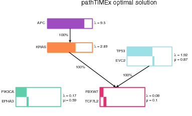
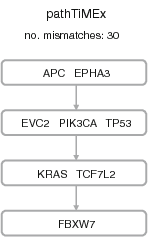
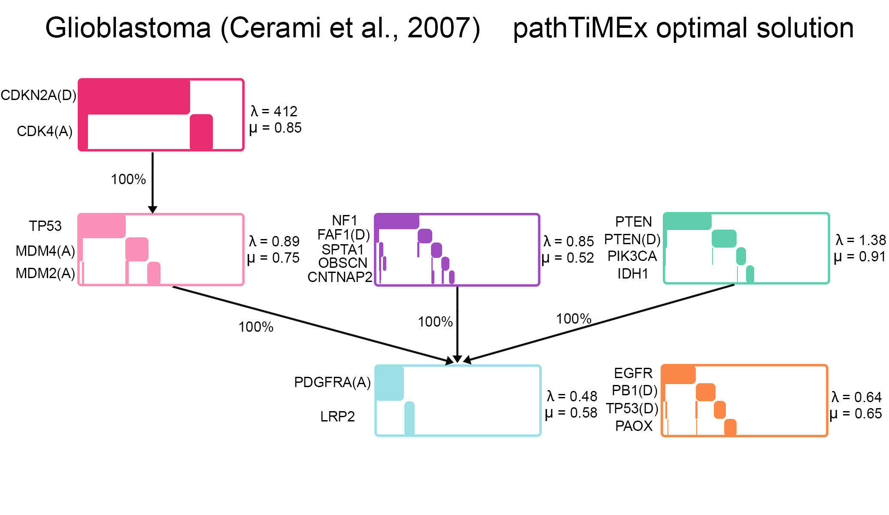
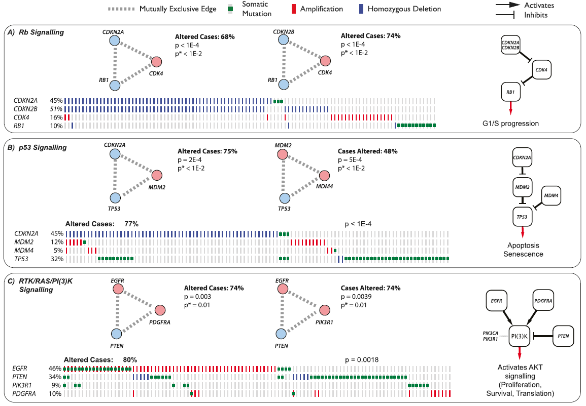
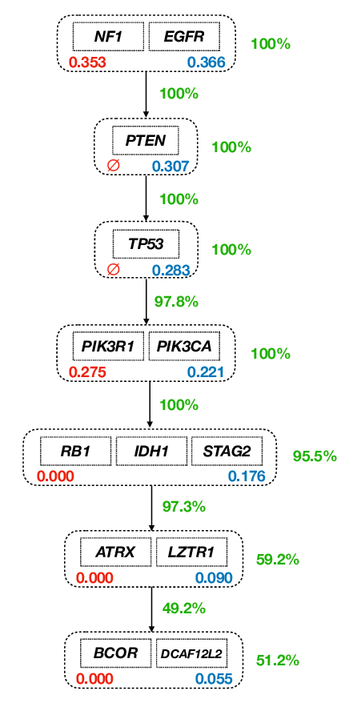

```{r setup, include = FALSE}
time0 <- Sys.time()
knitr::opts_chunk$set(echo = TRUE, collapse = FALSE)
options(width = 70)
require(BiocStyle)
require(pander)
library(OncoSimulR)
```

# Introduction
Understating the factors involved in tumor progression can lead to highlight
gene interactions or key mutations that would be valuable for various 
therapeutic purposes.  

One of the tools used to do so are cancer progression models ( _CPMs_ ), which
allow us to identify the constrains or dependencies in the order of accumulation
of mutations that take place during tumor development. They return directed
acyclic graphs ( _DAGs_ ) in which the vertices or nodes are the potentially
mutated genes, and their restriction/relationships are the edges of the graph;
thus representing the possible genotypes that can occur in that tumor.  

Another convenient approach to understand cancer progression are fitness landscapes,
which specify the observed genotypes and their fitness delimiting paths from 
the wild-type to further stages as it accumulates mutations. 

Although fitness landscapes are highly useful, obtaining them isn't as easy as
delimiting _DAGs_ from a _CPM_. Both methods aren't interchangeable as _DAGs_ 
have some limitations; they represent the order of viable mutations needed
to transpire in the progression of a tumor, this is representative of sign
epistasis, a phenomenon that describes that the effect of a gene mutation depends
on its genetic background. But only providing the possible succession of mutations
and no fitness details of those genotypes is an important restriction as there
are other relevant events found in cancer, such as reciprocal sign epistasis, 
that it isn't able to describe but fitness landscapes can @uriarte18.   

Reciprocal sign epistasis is an event in which the genetic interaction of two
co-occurring mutations has an effect on the fitness of the genotype different
from the one they have individually; this comes in two flavors: synthetic 
lethality when the combination of those mutations is lethal to the cell, and
synthetic viability when their co-occurrence increases the overall fitness.  
This phenomena are well manifested in fitness landscapes as peaks and valleys.  

This high variance of fitness due to mutation interactions materializes as 
multiple possible evolutionary paths in fitness landscapes, where the order of 
mutations can have restrictions or show patterns of complementarity or exclusivity
(either synthetic lethality or the fact gaining a second mutation on the same
pathway doesn´t increase fitness).  

As many tumor progression models are based on DAGs and carry their limitations,
various algorithms have been created to infer pathway modules with their order of
mutation accumulation coming from cross-sectional data to obtain better models 
@schill19.

In this assignment we will use OncoSimulR's capabilities to map the simulation
of data of those models to show various possible interactions such as 
mutual exclusivity.
 
# Set of examples of colorectal cancer models  

pathTiMEx is an algorithm that takes cancer dataset and generates a probabilistic
model describing tumor progression in its temporal order of mutations in
mutually exclusive driver pathways @cristea17.  

The first few examples that we will show come from a colorectal cancer dataset
provided in @wood07. In Figure 3A (left) we can see the optimal set of pathway
mutations inferred by pathTiMEx that was consonant with previous knowledge.



Mapping that DAG with OncoSimulR looks like this:  

```{r example1_pathtimex_opt }
pt_cr_3A <- allFitnessEffects(data.frame(
  parent = c("Root", "Root", "Root", "A", "B", "C"),
  child = c("A", "C", "E", "B", "D", "D"),
  s = 0.5,
  sh = -1,
  typeDep = "MN"),
  geneToModule = c("Root" = "Root",
                   "A" = "APC",
                   "B" = "KRAS",
                   "C" = "TP53, EVC2",
                   "D" = "FBXW7, TCF7L2",
                   "E" = "PIK3CA, EPHA3"
  ))

plot(pt_cr_3A, expandModules = TRUE)

(cr_3A <- evalAllGenotypes(pt_cr_3A, order = FALSE, addwt = TRUE))

plot(cr_3A)
```

In other studies they assumed that cancer progressed following a single linear
path, so for the sake of comparison with those, in @cristea17  they set that
restriction to pathTiMEx for the previous dataset, obtaining a somewhat
similar set of mutations to those references. This more basic approach infers 
differences as the mutation in TP53 takes place before the one for KRAS as show
in Figure 4A.



```{r example2_pathtimex_linear}
# Translating the DAG from Figure 4A (left) using modules
pt_cr_4a <- allFitnessEffects(data.frame(parent = c("Root", "A", "B", "C"),
                                     child = c("A", "B", "C", "D"),
                                     s = 0.1,
                                     sh = -0.01,
                                     typeDep = "MN"),
                          geneToModule = c("Root" = "Root",
                                           "A" = "APC, EPHA3",
                                           "B" = "EVC2, PIK3CA, TP53",
                                           "C" = "KRAS, TCF7L2",
                                           "D" = "FBXW7")
                          )

plot(pt_cr_4a, expandModules = TRUE, autofit = TRUE)

# Obtaining and plotting the fitness for all possible genotypes
eag_cr_4a <- evalAllGenotypes(pt_cr_4a)
plot(eag_cr_4a, use_greppel = TRUE) # Looks hideous

# Showcase of a simulation of population change over time
simul_cr_4a_short <- oncoSimulIndiv(pt_cr_4a,
                              model="McFL",
                              onlyCancer = FALSE,
                              finalTime = 1000,
                              verbosity = 0,
                              mu = 1e-5,          # Standard mutation rate
                              initSize = 2000,
                              keepPhylog = TRUE,
                              seed = NULL,
                              detectionProb = NA,
                              detectionSize = NA,
                              errorHitMaxTries = FALSE,
                              errorHitWallTime = FALSE)
plot(simul_cr_4a_short, show = "genotypes", type = "line", 
     lwdClone = 2, legend.ncols = 4)


# Second showcase changing some 
simul_cr_4a_long <- oncoSimulIndiv(pt_cr_4a,
                              model="McFL",
                              onlyCancer = FALSE,
                              finalTime = 5000,
                              verbosity = 0,
                              mu = 1e-5,          # Standard mutation rate
                              initSize = 2000,
                              keepPhylog = TRUE,
                              seed = NULL,
                              detectionProb = NA,
                              detectionSize = NA,
                              errorHitMaxTries = FALSE,
                              errorHitWallTime = FALSE)
plot(simul_cr_4a_long, show = "genotypes", type = "line", 
     lwdClone = 2, legend.ncols = 4)

```


# Set of examples from glioblastoma 
Resumen

@cristea17

```{r tomate, echo=FALSE, out.width="90%", out.height="90%", fig.cap="\\label{fig:tomate}Ye."}

```

In Figure \@ref(fig:tomate) we notice its low quality

@ciriello12
```{r, echo=FALSE, out.width="130%", out.height="130%", fig.cap="Mi vieja."}

```


@mohag20

{height="720px"}

## Figures
You can enable figure captions by `fig_caption: yes` in YAML:

    output:
      rmarkdown::html_vignette:
        fig_caption: yes

Then you can use the chunk option `fig.cap = "Your figure caption."` in **knitr**.


