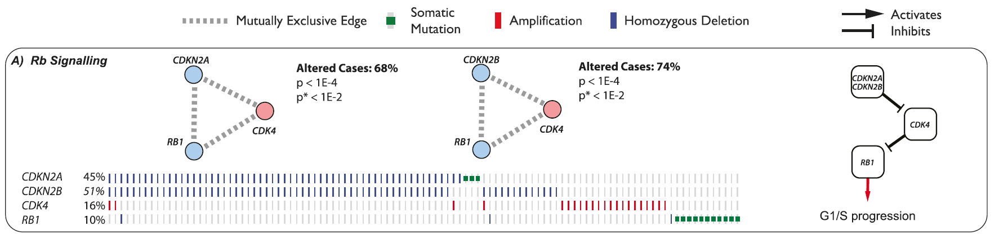
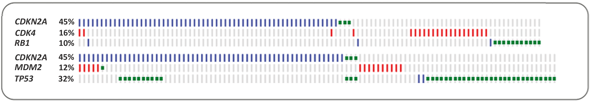

```{r setup, include = FALSE}
time0 <- Sys.time()
knitr::opts_chunk$set(echo = TRUE, collapse = FALSE)
options(width = 70)
require(BiocStyle)
require(pander)
library(ggplot2)
library(reshape2)
library(OncoSimulR)
```

# Introduction ## {#intro}

Understating the factors involved in tumor progression can lead to highlight
gene interactions or key mutations that would be valuable for various 
therapeutic purposes.  

One of the tools used to do so are cancer progression models ( __CPMs__ ), which
allow us to identify the constrains or dependencies in the order of accumulation
of mutations that take place during tumor development. They return directed
acyclic graphs ( __DAGs__ ) in which the vertices or nodes are the potentially
mutated genes, and their restriction/relationships are the edges of the graph;
thus representing the possible genotypes that can occur in that tumor.  

Another convenient approach to understand cancer progression are fitness landscapes,
which specify the observed genotypes and their fitness delimiting paths from 
the wild-type to further stages as it accumulates mutations. 

Although fitness landscapes are highly useful, obtaining them isn't as easy as
delimiting DAGs from a CPM. Both methods aren't interchangeable as DAGs 
have some limitations; they represent the order of viable mutations needed
to transpire in the progression of a tumor, this is representative of sign
epistasis, a phenomenon that describes that the effect of a gene mutation depends
on its genetic background. But only providing the possible succession of mutations
and no fitness details of those genotypes is an important restriction as there
are other relevant events found in cancer, such as reciprocal sign epistasis, 
that it isn't able to describe but fitness landscapes can (@uriarte18).   

Reciprocal sign epistasis is an event in which the genetic interaction of two
co-occurring mutations has an effect on the fitness of the genotype different
from the one they have individually; this comes in two flavors: synthetic 
lethality when the combination of those mutations is lethal to the cell, and
synthetic viability when their co-occurrence increases the overall fitness.  
This phenomena are well manifested in fitness landscapes as peaks and valleys.  

This high variance of fitness due to mutation interactions materializes as 
multiple possible evolutionary paths in fitness landscapes, where the order of 
mutations can have restrictions or show patterns of complementarity or exclusivity
(either synthetic lethality or the fact gaining a second mutation on the same
pathway doesn´t increase fitness). METER 

As many tumor progression models are based on DAGs and carry their limitations,
various algorithms have been created to infer pathway modules with their order of
mutation accumulation coming from cross-sectional data to obtain better models 
(@schill19).

Genes in modules? What more to explain in the introduction

In this assignment we will use `OncoSimulR`'s capabilities to map the simulation
of data of those models to show various possible interactions such as 
mutual exclusivity.
 
# Colorectal cancer model from Cristea et al., 2017  ## {#cr_mods}

pathTiMEx is an algorithm that takes cancer datasets and generates a probabilistic
model describing tumor progression in its temporal order of mutations in
mutually exclusive driver pathways.  

The first few examples that we will show come from a colorectal cancer dataset
provided in @wood07 that @cristea17 used to showcase their algorithm; pathTiMEx
founds two possible trajectories for this set of mutations, depending on whether
a linear path (order of mutations) was used as a restriction or not.  

## Examples of colorectal cancer model without linear progression ## {#pathex1}

On the left-hand side of Figure 3A we can see the optimal set of pathway mutations
inferred by pathTiMEx without using the limitation of a linear path; the results
obtained were consonant with previous knowledge.

```{r path3a, echo=FALSE, out.width="70%", out.height="70%", fig.cap="Figure 3A, left panel"}
knitr::include_graphics("figures/path_figure3a.png")
```

This figure shows that the temporal order of mutations in APC, KRAS and TP53
is maintained. There are two modules with mutual exclusivity, TP53/EVC2 and
PIK3CCA/EPHA3, that do not have a parent node but are nevertheless represented.
This means that order restrictions for mutations in these modules are not 
known, but the authors did find that these mutations occur at certain time 
points in tumor progression: mutations in TP53/EVC2 usually happen after
mutations in KRAS, while mutations in the PIK3CA/EPHA3 module were found to 
take place in later stages of tumor progression.

### 1st approach: Nodes with unkown requisites branching from the root ## {#pathex1_1}

With `OncoSimulR` we can represent this situation of knowing the temporal order
as in _"Mutation X happens after mutation in Y"_, creating a simple DAG of 
restrictions where the nodes with unknown restrictions simply branch from the
root node (i.e., the wild type):

```{r path_ex1_fig3a_DAG}
# Will be needed to plot the drivers
wood_drv <- c("APC", "KRAS", "TP53", "EVC2", "FBXW7", "TCF7L2", "PIK3CA", "EPHA3")

# Creating the DAG using genes modules 
wood_root <- allFitnessEffects(data.frame(
                              parent = c("Root", "Root", "Root", "A", "B", "C"),
                              child = c("A", "C", "E", "B", "D", "D"),
                              s = 0.2,
                              sh = -0.9,
                              typeDep = "MN"),
                              geneToModule = c("Root" = "Root",
                                               "A" = "APC",
                                               "B" = "KRAS",
                                               "C" = "TP53, EVC2",
                                               "D" = "FBXW7, TCF7L2",
                                               "E" = "PIK3CA, EPHA3"),
                              drvNames = wood_drv)

plot(wood_root, expandModules = TRUE, autofit = TRUE)
```

Now we could obtain the fitness landscape for this model, but the result is a
very busy plot:

```{r path_ex1_fig3a_FitLandscape}
# We could obtain the fitness for each genotype combination, 
# but it results in very busy plots as there are many combinations:
eAG_wood_root <- evalAllGenotypes(wood_root)

plot(eAG_wood_root)  # Overlapping labels
plot(eAG_wood_root, show_labels = FALSE) # Still not very good
```

A further step would be using the OncoSimulR function `oncoSimulIndiv` to
simulate tumor progression. As a lot of genotypes appear during this simulation,
we decided to plot the progression in the number of drivers instead:

```{r path_ex1_fig3a_simul}
simul_wood_root <- oncoSimulIndiv(wood_root,
                              model="McFL",
                              onlyCancer = FALSE,
                              finalTime = 5000,
                              verbosity = 0,
                              mu = 1e-5,
                              initSize = 2000,
                              keepPhylog = TRUE,
                              seed = NULL,
                              detectionProb = NA,
                              detectionSize = NA,
                              detectionDrivers = NA,
                              errorHitMaxTries = FALSE,
                              errorHitWallTime = FALSE
                              )

# Since plotting genotypes results in a very busy plot,
# we will only plot the number of drivers:

# xlim = c(0, 5000) shows full time-lapse for comparison of 
# clones with five vs. six mutated drivers

plot(simul_wood_root, addtot = TRUE, lwdClone = 0.9, log = "",
     thinData = TRUE, thinData.keep = 0.3,
     plotDiversity = TRUE,
     xlim = c(0, 5000)) 

## Another flavor of plotting
plot(simul_wood_root, type = "stacked", thinData = TRUE, 
     thinData.keep = 0.1,
     plotDiversity = TRUE,
     xlim = c(0, 5000))
```

We can see that the main clones have 5 mutations in driver genes, which makes
sense according to the DAG. Clones with 6-7 mutated drivers are those in which
genes with mutual exclusivity are mutated. Their frequency is very low, but they
do appear: sh is not -1 because the most likely explanation for this mutual
exclusivity is a lack of positive selection rather than synthetic lethality
(i.e. clones with both mutations are not viable.) 

If we look carefully at the DAG of restrictions for this model we will see that
it is possible to get genotypes in which TP53 is mutated before KRAS is, or even
genotypes in which mutations in the PIK3CA/EPHA3 module occur at the beginning of
tumor progression rather than in later stages. For this particular simulation, 
the genotypes that appear are: 

```{r pathx_ex1_fig3a_tree}
plotClonePhylog(simul_wood_root)
```

### 2nd approach: Adding order effects ## {#pathex1_2}

We could use the same DAG of restrictions but adding order effects;
the authors do not mention or suggest the existence of these effects in this
case, but we believe this hypothesis is not contradictory to the graph either.
In fact, we think the following graph would be the one that makes the least 
assumptions about the data including the temporal information about the order
in which mutations are believed to happen in this type of tumors.

1. The positive effect on fitness is higher if mutations in KRAS happen before 
mutations in TP53/EVC2 compared to the opposite order. 
2. The same thing happens if mutations in PIK3CA/EPHA3 appear once KRAS is mutated.
3. As the authors consider that mutations in PIK3CA/EPHA3 appear in late stages 
of tumor progression, we considered that mutating these genes after mutations in 
KRAS appear results in a higher fitness as well.

```{r path_ex2_fig3a_order_effects}
wood_order <- allFitnessEffects(data.frame(
        parent = c("Root", "A", "B", "C"),
        child = c("A", "B", "D", "D"),
        s = 0.2,
        sh = -0.9,
        typeDep = "MN"),
        geneToModule = c("Root" = "Root",
                         "A" = "APC",
                         "B" = "KRAS",
                         "C" = "TP53, EVC2",
                         "D" = "FBXW7, TCF7L2",
                         "E" = "PIK3CA, EPHA3"),
        drvNames = wood_drv,
        orderEffects = c("B > C" = 0.02,
                         "B > E" = 0.02,
                         "C > E" = 0.01)
        )

plot(wood_order, expandModules = TRUE, autofit = TRUE)

# Save all fitness values for later comparison, limited to avoid errors
eAG_wood_order <- evalAllGenotypes(wood_order, order = TRUE, max = 110000) 
```

We could perform simulations with `oncoSimulPop`, which calls `oncoSimulIndiv`
multiple times (in this case, 25):

```{r path_ex2_simul}
simul_order <- oncoSimulPop(25, wood_order,
                              model = "McFL",
                              onlyCancer = FALSE,
                              finalTime = 5000,
                              verbosity = 0,
                              keepPhylog = TRUE,
                              initSize = 2000,
                              mu = 1e-5,
                              sampleEvery = .03,
                              keepEvery = 1,
                              detectionProb = NA,
                              detectionSize = NA,
                              detectionDrivers = NA,
                              errorHitMaxTries = FALSE,
                              errorHitWallTime = FALSE)
```

Now, we will take a sample from this simulation and plot the resulting genotypes:

```{r path_ex2_simul_sample, message= FALSE}
sp_order <- samplePop(simul_order, "unif", "singleCell")
ordered.df <- sp_order[ , c(1, 5, 8, 3, 4, 7, 6, 2)] # Reorders columns
df.long <- melt(ordered.df) # Convert wide to long
gg <- ggplot(subset(df.long, value == 1), aes(x = Var1, y = Var2))
gg <- gg + geom_point(size = 3, shape = 22, aes(fill = Var2))
gg <- gg + labs(y = "Mutated gene", x = "Simulation")
gg
```

### One step further: What if these nodes depend on KRAS? ## {#pathex1_3}
Now that we believe we have implemented the model described by the authors, we
wanted to model a situation in which the modules TP53/EVC2 and PIK3CA/EPHA3
depend from KRAS. Note that this is different from the model described by the
authors, as we are now assuming a restriction that they did not report: 


```{r path_ex3_fig3a_order_effects_kras}
wood_kras <- allFitnessEffects(data.frame(
                              parent = c("Root", "A", "B", "B", "B", "C"),
                              child = c("A", "B", "D", "C", "E", "E"),
                              s = 0.2,
                              sh = -0.9,
                              typeDep = "MN"),
                              geneToModule = c("Root" = "Root",
                                               "A" = "APC",
                                               "B" = "KRAS",
                                               "C" = "TP53, EVC2",
                                               "D" = "PIK3CA, EPHA3",
                                               "E" = "FBXW7, TCF7L2"),
                              drvNames = wood_drv
                              )

plot(wood_kras, expandModules = TRUE, autofit = TRUE)

eAG_wood_kras <- evalAllGenotypes(wood_kras) # We will use this later
```

We could perform the same simulation as before, and the resulting figure
would be quite similar:

```{r path_ex3_simul, message= FALSE}
simul_kras <- oncoSimulPop(25, wood_kras,
                              model = "McFL",
                              onlyCancer = FALSE,
                              finalTime = 5000,
                              verbosity = 0,
                              keepPhylog = TRUE,
                              initSize = 2000,
                              mu = 1e-5,
                              sampleEvery = .03,
                              keepEvery = 1,
                              detectionProb = NA,
                              detectionSize = NA,
                              detectionDrivers = NA,
                              errorHitMaxTries = FALSE,
                              errorHitWallTime = FALSE)

sp_kras <- samplePop(simul_kras, "unif", "singleCell")  

ordered.df <- sp_kras[ , c(1, 5, 8, 3, 4, 7, 6, 2)] # Reorders columns
df.long <- melt(ordered.df) # Convert wide to long
gg <- ggplot(subset(df.long, value == 1), aes(x = Var1, y = Var2))
gg <- gg + geom_point(size = 3, shape = 22, aes(fill = Var2))
gg <- gg + labs(y = "Mutated gene", x = "Simulation")
gg
```

## Example of colorectal cancer model with linear progression ## {#pathex2}

This particular case was made by the authors to compare their approach to the
one by @vandin15. This model does not respect the order
in driver mutations that we already mentioned, as mutations in TP53 would appear
before mutations in KRAS, and imposes an "artificial" restriction on tumor 
progression by enforcing a linear progression. We still thought it could be 
illustrative to show the DAG of restrictions, but we will not go deeper into
this model.

The DAG was taken from the left-hand side of Figure 4A.

```{r path4a, echo=FALSE, out.width="30%", out.height="30%", fig.cap=" Figura 4A de PathTiMEx."}
knitr::include_graphics("figures/path_figure4a.png")
```

The resulting DAG of restrictions would be:

```{r path_ex1_fig4a}
wood_linear <- allFitnessEffects(data.frame(parent = c("Root", "A", "B", "C"),
                                     child = c("A", "B", "C", "D"),
                                     s = 0.2,
                                     sh = -0.9,
                                     typeDep = "MN"),
                                  geneToModule = c("Root" = "Root",
                                                   "A" = "APC, EPHA3",
                                                   "B" = "EVC2, PIK3CA, TP53",
                                                   "C" = "KRAS, TCF7L2",
                                                   "D" = "FBXW7"),
                                  drvNames = wood_drv
                                  )


plot(wood_linear, expandModules = TRUE, autofit = TRUE)
```


## Order effects vs. monotonic dependency ## {#pathex3}

We have seen four approaches. Three of them use Figure 3A as base to build
the DAG, with small differences as there are two nodes (TP53/EVC2 and PIK3CA/
EPHA2) that the authors describe as "independent" and that do not have a
parent node in the graph. In order to include these nodes in our model, we 
have devised three possible approaches: 

(1) these nodes come from the root node (i.e. the wild type) (Section \@ref(pathex1)); 
(2) these nodes are independent (as the authors suggest) and the effects of 
    these mutations are different depending on the order in which they occur;
(3) these nodes are both child nodes from KRAS.

The last approach (4) is based on Figure 4A, where a linear progression is 
imposed, but we will not focus on this one as we believe it is imposing 
artificial restraints on tumor progression.

As for approaches (2) and (3), the former is what we believe results in a most
accurate description of the model, as it does not assume any new dependencies. We
decided to implement approach number (3) as well because we thought it would be
interesting to compare both of them and what they mean. 

As the fitness landscapes resulting from `evalAllGenotypes` show a lot of 
genotypes and are not readable, we will focus on specific genotypes and compare
their resulting fitnesses. 

First, if we look at genotypes where only APC, KRAS and TP53 are mutated in the
`wood_order` model, we will see what these order effects mean (the symbol '>'
between two genes A and B, 'A > B', means that A is mutated before B):

```{r path_ex_discuss_1}

## If we use order effects, these genotypes will have different fitnesses:
eAG_wood_order[grep("^APC > TP53 > KRAS$", eAG_wood_order[,1]),]  

#              Genotype Fitness
# 104 APC > TP53 > KRAS    1.44

# 1. 44 = 1.2 * 1.2

eAG_wood_order[grep("^APC > KRAS > TP53$", eAG_wood_order[,1]),]   

#            Genotype Fitness
# 88 APC > KRAS > TP53  1.4688

# 1.4688 = 1.2 * 1.2 * 1.02 --> extra advantage thanks to the order effects
```

In the `wood_kras` model, there is only one possible genotype, in which all
restrictions are followed and the mutation order is APC > KRAS > TP53:

```{r path_ex_discuss_2}
eAG_wood_kras[54,]   
 
#           Genotype Fitness
# 54 APC, KRAS, TP53   1.728

# 1.728 = 1.2 * 1.2 * 1.2
```

We would see a similar thing if we added mutations in PIK3CA to the previous
examples. Moving on, it is also interesting to study the fitness of genotypes 
such as those in which only PIK3CA and TP53 are mutated. This respects all 
restrictions in the `wood_order` model, but does not in the `wood_kras` one, 
resulting in very different fitnesses. This is a very explicit way to see that
the two models are, in fact, very different from each other; and that assuming
an extra restriction has great effects on fitness:

```{r path_ex_discuss_3}

eAG_wood_kras[35,]   

#        Genotype Fitness
# 35 PIK3CA, TP53    0.01

# 0.01 = 0.1 * 0.1

eAG_wood_order[grep("^PIK3CA > TP53$", eAG_wood_order[,1]),]  

#         Genotype Fitness
# 50 PIK3CA > TP53       1

# 1 --> There is no positive (or negative) effect on fitness
# relative to the wild type

eAG_wood_order[grep("^TP53 > PIK3CA$", eAG_wood_order[,1]),]   

#         Genotype Fitness
# 63 TP53 > PIK3CA    1.01

# 1.01 = 1 * 1.01
```

# Glioblastoma multiforme models ## {#gb_mods}

## @cristea17 ## {#crist17}

@cristea17 also showcased pathTiMEx's performance using a large gliobastoma 
dataset from The Cancer Genome Atlas Program (TCGA) (@cerami12); we will
map the DAG coming from the left-hand side of Figure 3C (\@ref(fig:path3c)).
Our purpose here is to show that tumor progression in glioblastoma multiforme
seems much more complex: all the nodes are modules with mutual exclusivity,
which suggests variability in this process is larger. 

Furthermore, a closer look at the figure will reveal this algorithm found different
modules where a certain gene is repeated (this happens with TP53 in the figure).
The authors solved this issue by differentiating the type of mutation that happens
in each case, but having modules with overlapping genes can be a problem, as
we will see in the next section.

```{r path3c, echo=FALSE, out.width="90%", out.height="90%",fig.cap= "\\label{fig:tomate}. Detail of left-hand size of Figure 3C from @cristea17."}
knitr::include_graphics("figures/path_figure3c.png")
```

This DAG has the same issues as the previous one, and therefore we could think
of the three same strategies to represent it: a "naïve" one where the nodes with
unknown dependencies branch directly from the root node, a more accurate version
implementing order effects, or a model where we go one step further to see what
would happen if more restrictions were implemented. 

In this case, we will only show the three DAGs of dependencies, just to exhibit the
high complexity of tumor progression in this case, and then we will move on to
a slightly different model.

### 1st approach: modules branching from the root node ## {#crist17_1}

```{r path_fig3c_root}
gb_drv <- c("CDKN2A", "CDK4", "TP53-M", "MDM4", "MDM2", 
            "NF1", "FAF1", "SPTA1", "OBSCN", "CNTNAP2", 
            "PTEN-M", "PTEN-D", "PIK3CA", "IDH1",
            "PDGFRA", "LRP2", "EGFR", "RB1", "TP53-D", "PAOX")

# All nodes with unknown prerequisites/previous mutations will
# be modeled as if they branch from Root
TCGA_gb_root <- allFitnessEffects(data.frame(
                  parent = c("Root", "A", "Root", "Root", "B", "C", "D", "Root"),
                  child = c("A", "B", "C", "D", "E", "E", "E", "F"),
                  s = 0.2,
                  sh = -0.9,
                  typeDep = "MN"),
                  geneToModule = c("Root" = "Root",
                                   "A" = "CDKN2A, CDK4",
                                   "B" = "TP53-M, MDM4, MDM2",
                                   "C" = "NF1, FAF1, SPTA1, OBSCN, CNTNAP2",
                                   "D" = "PTEN-M, PTEN-D, PIK3CA, IDH1",
                                   "E" = "PDGFRA, LRP2",
                                   "F" = "EGFR, RB1, TP53-D, PAOX"),
                  drvNames = gb_drv)

plot(TCGA_gb_root, expandModules = TRUE, autofit = TRUE)
```

### Model incorporating order effects ## {#crist17_2}

```{r path_fig3c_order}
TCGA_gb_order <- allFitnessEffects(data.frame(
        parent = c("Root", "A", "B", "C", "D"),
        child = c("A", "B", rep("E", 3)),
        s = 0.2,
        sh = -0.9,
        typeDep = "MN"),
        geneToModule = c("Root" = "Root",
                         "A" = "CDKN2A, CDK4",
                         "B" = "TP53-M, MDM4, MDM2",
                         "C" = "NF1, FAF1, SPTA1, OBSCN, CNTNAP2",
                         "D" = "PTEN-M, PTEN-D, PIK3CA, IDH1",
                         "E" = "PDGFRA, LRP2",
                         "F" = "EGFR, RB1, TP53-D, PAOX"),
        orderEffects = c("A > C" = 0.02,
                         "A > D" = 0.02,
                         "B > F" = 0.02,
                         "C > F" = 0.02,
                         "D > F" = 0.02)
        )

plot(TCGA_gb_order, expandModules = TRUE, autofit = TRUE)
```

### Implementing new dependencies ## {#crist17_3}

```{r path_fig3c_dependencies}
TCGA_gb_dep <- allFitnessEffects(data.frame(
                    parent = c("Root", rep("A", 3), rep(c("B", "C", "D"), 2)),
                    child = c("A", "B", "C", "D", rep("E", 3), rep("F", 3)),
                    s = 0.2,
                    sh = -0.9,
                    typeDep = "MN"),
                    geneToModule = c("Root" = "Root",
                                     "A" = "CDKN2A, CDK4",
                                     "B" = "TP53-M, MDM4, MDM2",
                                     "C" = "NF1, FAF1, SPTA1, OBSCN, CNTNAP2",
                                     "D" = "PTEN-M, PTEN-D, PIK3CA, IDH1",
                                     "E" = "PDGFRA, LRP2",
                                     "F" = "EGFR, RB1, TP53-D, PAOX"))
plot(TCGA_gb_dep, expandModules = TRUE, autofit = TRUE)
```


## Ciriello et al., 2012 ## {#ciri12}

Continuing with the modeling of mutual exclusivity relationships in cancer, we tried to map two examples described in @ciriello12.

These authors developed a novel tool to detect mutual exclusivity networks and tested it with multiple dataset, including the glioblastoma multiforme from TGCA. This software identifies the mutual exclusivity genomic alterations in the PI(3)K, p53 and Rb pathways but it also remarks the possibility of finding a gene represented in more than one module. 

We know this last point is contrary to the very definition of module, which states that "each module is a set of genes and the intersection between modules is the empty set". All the same, the literature is full of examples where a gene is involved in more than one pathway so we considered that modeling this cases would be of great interest.

### Case A: Mutual exclusivity pair broken inside a module ## {#ciri12_a}

The algorithm of Cirello et al. was able to detect 2 mutual exclusivity networks within one pathway. This is the Rb signalling pathway, which is composed of 4 genes: CDKN2A, CDKN2B, CDK4 and RB1. The first network includes CDKN2A, CDK4 and Rb1 while the other is formed by CDKN2B, CDK4 and Rb1. 

```{r, echo=FALSE, out.width="130%", out.height="130%", fig.cap="Fig X. Poner pie"}

```

Then, modeling this example seems to be conceptually easy because we just need to define 2 modules representing each mutual exclusivity network, but it is technically impossible.

```{r GB_modules_1, error=TRUE}
PT_cr_simple <- allFitnessEffects(data.frame(parent = c("Root", "Root"),
                                             child = c("A", "B"),
                                             s = 0.5,
                                             typeDep = "MN"),
                                             geneToModule = c("Root" = "Root",
                                                              "A" = "CDKN2A, CDK4, Rb1",
                                                              "B" = "CDKN2B, CDK4, Rb1"))
```

This situation led us to specify the fitness of each genotype manually. For this purpose, we examined the data and came to the conclusion that the fitness of the genotypes CDKN2A+CDKN2B, CDK4 and Rb1 must be the same so we can find any of these possibilities when we run multiple simulations (if any of these genotypes had a higher or lower fitness than the others we would find it overrepresented or never observed). Then we set (arbitrarially) the fitness of these genotypes to 4, being the fitness of CDKN2A or CDKN2B alone 2 (following the multiplicative model)

Beyond these asumption, more questions are raised when we think of more complex genotypes. Specifting the fitness of each combination of genotypes is not a trivial task:

* If we start from a mutation in CDKN2A or CDNK2B (fitness = 2) and we add a mutation in CDK4 or Rb1, the fitness of the resultant genotype would still be 2 since they are mutually exclusive (it doesn't add any selective advantage). However, if we want to reach the same genotype following a different order, we find that adding a mutation in CDKN2A or CDNK2B to a CDK4 or RB1 clone (fitness = 4) would find a decrease in fitness that is not justified biologically.
* Alternatively, we could set the fitness of CDNK2A/CDKN2B + CDK4/RB1 clones to 4 (to avoid the unjustified decrease), but this would mean that adding a mutation in CDK4/RB1 to a CDNK2A/CDKN2B clone involves an increase in the fitness (2 -> 4) that breaks the mutual exclusuvity principle. 
* Another option is to specify order effects in the genotypes so we could avoid the drawback from the previous points, but we didn't find a biological reason that could explain that a CDKN2A > CDKN2A, CDK4 clone had a different fitness than CDK4 > CDKN2A, CDK4.

We represented the fitness landscape resulting from applying the first point so our problem can be visualized better:

```{r, echo=FALSE}
GB_ciri_manual <- data.frame(Genotype = c("WT", "CDKN2A", "CDKN2B", "CDK4", "RB1", 
                             "CDKN2A, CDKN2B", "CDKN2A, CDK4", "CDKN2A, RB1",
                             "CDKN2B, CDK4", "CDKN2B, RB1", "RB1, CDK4",
                             "CDKN2A, CDKN2B, CDK4", "CDKN2A, CDKN2B, RB1",
                             "CDKN2A, CDK4, RB1", "CDKN2B, CDK4, RB1",
                             "CDKN2A, CDKN2B, CDK4, RB1"), 
                  Fitness = c(1, 2, 2, 4, 4,
                              4, 2, 2,
                              2, 2, 4,
                              4, 4,
                              2, 2,
                              4
                              ))
GB_ciri_manual_aFE <- allFitnessEffects(genotFitness = GB_ciri_manual)
GB_ciri_manual_eAG <- evalAllGenotypes(GB_ciri_manual_aFE, order = FALSE, addwt = TRUE)
plot(GB_ciri_manual_eAG, use_ggrepel = TRUE)
```

In order to test the accuracy of this model reproducing the data we run several simulations. Note that we have adjusted the mutation frequency of each gene so we can obtain proportions of genotypes similar to the TCGA glioblastoma dataset. 

```{r, message=FALSE}
muvar_gb <- c("CDKN2A" = 5e-4, "CDKN2B" = 5e-4, "CDK4" = 4e-5, "RB1" = 4e-5)
GB_simulPop <- oncoSimulPop(50, GB_ciri_manual_aFE,
                            initSize = 500,
                            model = "McFL",
                            mu = muvar_gb, 
                            detectionDrivers = NA, 
                            finalTime = 2500,
                            detectionSize = NA, 
                            detectionProb = NA,
                            onlyCancer = FALSE, 
                            mc.cores = 2, ## adapt to your hardware
                            seed = NULL)
data_GB_simulPop <- samplePop(GB_simulPop)
GB_ordered.df <- data_GB_simulPop[order(-data_GB_simulPop[,2],
                                     -data_GB_simulPop[,3],
                                     -data_GB_simulPop[,1],
                                     -data_GB_simulPop[,4]),]
GB_df.long <- melt(GB_ordered.df)
gg <- ggplot(subset(GB_df.long, value == 1), aes(x = Var1, y = Var2))
gg <- gg + geom_point(size = 3, shape = 22, aes(fill = Var2))
gg <- gg + labs(y = "Mutated gene", x = "Simulation")
gg
```

One interesting thing from this model is that, given the appropriate parameters, it replicates relatively well the data presented in @ciriello12. 

### Case B: One gene shared by two modules ## {#ciri_b}

To further investigate the issue presented in this section, we decided to generate a model where a gene is shared by 2 different groups. 

In this case, we have taken the previous mutually exclusive network formed by CDKN2A, CDK4 and RB1 and merged it with the network composed by CDKN2A, MDM2 and TP53, which @ciriello12 detected in the p53 signaling pathway

```{r, echo=FALSE, out.width="130%", out.height="130%", fig.cap="Fig X. Poner pie"}
knitr::include_graphics("figures/ciriello_figure2.png")
```

We started by specifying the fitness manually again, following the next logic:

* Each of the individual genotypes has the same fitness (e.g., 2 for the simplicity of the example)
  + We could think of giving the CDKN2A a higher fitness since mutating it means affecting 2 pathways at the same time but this would lead to the breaking of the mutual exclusivity (e. g., P53 > P53, CDKN2A would involve a increase in fitness)
  + We know that giving CDKN2A, CDK4 and RB1 the same fitness contradicts the previous example, but in this case we are not taking into account the presence of CDKN2B
* Each pair of genes where each gene belong to a different module, except for the shared gene (CDKN2A), has a higher fitness (e.g 4, following the multiplicative model).
  + This is nothing new, just considering the increase in fitness produced by 2 mutations in "unrelated" genes.
* Then, we find again issues related to the specification of more complex genotypes. Specifically, when we add a mutually exclusivity gene to a non mutually exclusivity pair (e.g we have a CDK4, p53 clone (fitness = 4) and we add a mutation in CDKN2A). In these cases we have the 3 possibilities too (similar to the case A)
  + The fitness of the 3 gene clone remains the same. This seems logical since we are adding a mutation in a gene that provides no advantage, but if we change the order of the mutations we see that the mutual exclusivity is broken
     + CDK4, p53 (fitness = 4) -> CDK4, p53, CDKN2A (fitness = 4). This is ok
     + CDK4, CDKN2A (fitness = 2) -> CDK4, p53, CDKN2A (fitness = 4). This is not ok, mutual exclusivity rule is broken.
  + The fitness of the 3 gene clone is decreased in order to not to breax the mutual exclusivity rule. This lacks of apparent biological justification.
  + The fitness of the 3 gene clone is different according to the order of mutations. Lacks of apparent biological justification too. 

We represented the fitness landscape resulting from applying the second point, preserving the mutually exclusive principle (this doesn't mean it is correct):

```{r}
GB_2mod <- data.frame(Genotype = c("WT", "CDKN2A", "CDK4", "RB1", "TP53", "MDM2", #1, 2, 2, 2, 2, 2,
                                  "CDKN2A, CDK4", "CDKN2A, RB1", "CDKN2A, TP53", "CDKN2A, MDM2", #2, 2, 2, 2, 2
                                  "CDK4, RB1", "CDK4, TP53", "CDK4, MDM2",#2, 4, 4
                                  "RB1, TP53", "RB1, MDM2",#4, 4
                                  "TP53, MDM2",#2
                                  "CDKN2A, CDK4, RB1", "CDKN2A, CDK4, TP53", "CDKN2A, CDK4, MDM2", #2, 2, 2
                                  "CDKN2A, RB1, TP53", "CDKN2A, RB1, MDM2", #2, 2 
                                  "CDKN2A, TP53, MDM2", #2
                                  "CDK4, RB1, TP53", "CDK4, RB1, MDM2",#2, 2
                                  "CDK4, TP53, MDM2",#2
                                  "RB1, TP53, MDM2",#2
                                  "CDKN2A, CDK4, RB1, TP53", "CDKN2A, CDK4, RB1, MDM2", #2, 2
                                  "CDK4, CDKN2A, MDM2, TP53", #2
                                  "CDKN2A, RB1, TP53, MDM2", #2, 
                                  "CDK4, RB1, TP53, MDM2",#2
                                  "CDKN2A, CDK4, RB1, TP53, MDM2"),#2
                     Fitness = c(1, 2, 2, 2, 2, 2,
                                 2, 2, 2, 2,
                                 2, 4, 4,
                                 4, 4,
                                 2, 
                                 2, 2, 2,
                                 2, 2,
                                 2,
                                 2, 2,
                                 2,
                                 2,
                                 2, 2,
                                 2,
                                 2,
                                 2,
                                 2))

GB_2mod_aFE <- allFitnessEffects(genotFitness = GB_2mod)
GB_2mod_eAG <- evalAllGenotypes(GB_2mod_aFE, order = FALSE, addwt = TRUE)
plot(GB_2mod_eAG, use_ggrepel = TRUE)

```

Simply looking at the fitness landscape we can see that this model is not going to replicate the results properly since the complex genotypes have considerably lower fitness (but this is needed to preserve the mutual exclusion logic). Anyway we decided to run simulations, similarilly to case A: 

```{r, message=FALSE}
muvar_gb2 <- c("CDKN2A" = 5e-4, "CDK4" = 5e-5, "RB1" = 5e-5,
               "MDM2" = 5e-5, "TP53" = 5e-5)
GB_simulPop2 <- oncoSimulPop(25, GB_2mod_aFE,
                            initSize = 500,
                            model = "McFL",
                            mu = muvar_gb2, 
                            detectionDrivers = NA, 
                            finalTime = 2500,
                            detectionSize = NA, 
                            detectionProb = NA,
                            onlyCancer = FALSE, 
                            mc.cores = 2, ## adapt to your hardware
                            seed = NULL)
data_GB_simulPop2 <- samplePop(GB_simulPop2)
GB_ordered.df2 <- data_GB_simulPop2[order(-data_GB_simulPop2[,2],
                                     -data_GB_simulPop2[,3],
                                     -data_GB_simulPop2[,1],
                                     -data_GB_simulPop2[,4]),]
GB_df.long2 <- melt(GB_ordered.df2)
gg <- ggplot(subset(GB_df.long2, value == 1), aes(x = Var1, y = Var2))
gg <- gg + geom_point(size = 3, shape = 22, aes(fill = Var2))
gg <- gg + labs(y = "Mutated gene", x = "Simulation")
gg
```

In this case, we don't expect our model to simulate the data presented in @ciriello12 since most 2-gene clones have a fitness of 4 while all 3-gene, 4-gene and 5-gene genotypes have a fitness of 2 due to mutually exclusive restrictions. 

```{r, echo=FALSE}

```

### Case C: The problem simplified ## {#ciri12_c}

We know the cases presented here can be hard to visualize at first glance. To make things clear about what is going on in cases A and B we have made up a model with three genes: A, B and C. A and B are mutually exclusive, B and C are also mutually exclusive but A and C are not mutually exclusive (e.g., A could be CDK4, B could be CDKN2A and C could be TP53). 

Then we determine: 

* The fitness of the individual clones to be the same (e.g fitness A = fitness B = fitness C = 2). 
* The combination of mutually exclusive mutations doesn't raise or lower the fitness (fitness A, B = fitness B, C).
* The combination of non mutually exclusive mutations raises the fitness according to the multiplicative model (fitness A, C = 4).

But now, what would be the fitness of an A, B, C clone? It is impossible given the geometrical constrains imposed by the mutual exclusion restrictions. This means that:

* If we set the fitness of the A, B, C genotype on 4, considering that mutating B in a A, C clone doesn't modify its fitness, we would find that paths from A, B and B, C to A, B, C break the mutual exclusivity (because we observe an increment in fitness)
* If we set the fitness of the A, B, C genotype on 2, considering that mutating A in B, C or mutating C in A, B don't modify their fitness, we would find that the path from A, C to A, B, C necessarily involves a decrease in fitness. 
* Alternatively specifying fitness taking into account order of mutations would prevent facing these problems, but we need to find a biological explanation that justifies that a A > B > C clone presents a different fitness than A > C > B, B > A > C, C > B > A or B > C > A clones.

We invite you to take a look at the fitness landscape, play with the genotypes and try to satisfy all the conditions explained above:

```{r}
three_g <- data.frame(Genotype = c("WT", "A", "B", "C",
                                   "A, B", "A, C", "B, C",
                                   "A, B, C"), 
                     Fitness = c(1, 2, 2, 2,
                                 2, 4, 2,
                                 2))
three_g_aFE <- allFitnessEffects(genotFitness = three_g)
three_g_eAG <- evalAllGenotypes(three_g_aFE, order = FALSE, addwt = TRUE)
plot(three_g_eAG, use_ggrepel = TRUE)
```

# Discussion

# References